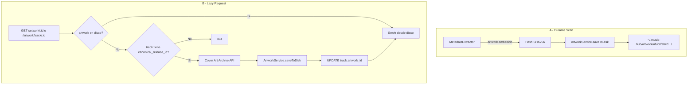

# Plan: Artwork Híbrido en Disco (Scan + Lazy MusicBrainz)

## Resumen

- **A (Scan):** Artwork embebido se extrae durante el scan y se guarda en disco con estructura profesional.
- **B (Lazy):** Si el track no tiene artwork pero tiene `canonical_release_id`, se pide a Cover Art Archive en la primera petición y se cachea en disco.
- **Profesional:** Content-addressable (hash), múltiples tamaños (250/500/1200 px), estructura de directorios escalable.

## Arquitectura



## Estructura en Disco

```
~/.music-hub/artwork/
  {hash[0:2]}/           # Sharding por 2 primeros chars del hash
    {hash}-250.jpg
    {hash}-500.jpg
    {hash}-1200.jpg
    {hash}.{ext}         # Full original (opcional, o 1200 como "full")
```

- **Content-addressable:** hash = SHA256 de la imagen full. Mismo artwork = mismo hash = deduplicación automática.
- **Tamaños:** 250, 500, 1200 px (alineado con [Cover Art Archive API](https://musicbrainz.org/doc/Cover_Art_Archive/API)).
- **Formato:** JPEG para thumbnails (compatibilidad); original si es PNG/WebP.

## Cambios en Base de Datos

- **Eliminar** tabla `artwork` (BLOB) y columnas relacionadas.
- **Mantener** `tracks.artwork_id` como referencia al hash (content-addressable). El valor es el hash, no `art_${trackId}`.
- **Migración:** Para DBs existentes, extraer artwork de la tabla actual a disco antes de dropear (o dejar migración manual para usuarios).

## Flujo A: Scan (artwork embebido)

1. **MetadataExtractor** sigue extrayendo `artwork` + `artworkMimeType` como antes.
2. **Nuevo ArtworkService** en `desktop/src/artwork/index.ts`:
   - `saveFromBuffer(data, mimeType): string` → hash, genera thumbnails 250/500/1200 con `sharp`, guarda en disco, devuelve hash.
   - `getPath(hash, size?: 250|500|1200): string` → ruta al archivo.
3. **Scanner** (`index.ts`): en vez de `db.insertArtwork()`, llama a `artworkService.saveFromBuffer()` y asigna `track.artworkId = hash`.
4. **Watcher** (onAdd): mismo patrón.
5. **Dependencia:** `jimp` para redimensionar (pure JS, sin native deps).

## Flujo B: Lazy Fetch (sin artwork, con canonical_release_id)

1. **Rutas de artwork** (`streaming/index.ts`, `api/routes/artwork.ts`): antes de devolver 404:
   - Si `id` es un trackId (ruta `/artwork/track/:trackId`) o si se puede resolver por track:
     - Obtener track.
     - Si `!track.artworkId && track.canonicalReleaseId`:
       - Extraer MBID: `canonicalReleaseId` tiene formato `musicbrainz:release:UUID` → `UUID`.
       - Llamar a Cover Art Archive: `GET https://coverartarchive.org/release/{mbid}/` (JSON).
       - Del JSON, tomar la imagen `front: true` y sus `thumbnails.250`, `.500`, `.1200`.
       - Descargar las 3 URLs, guardar con ArtworkService.
       - `db.updateTrackArtwork(trackId, hash)`.
       - Servir desde disco.
2. **User-Agent:** `MusicHub/0.1.1 (metadata-enrichment)`.

## Enrichment

- **Quitar** la lógica de fetch de artwork del enrichment (`musicbrainz.ts`). El artwork se obtiene solo de forma lazy al pedirlo.

## API Cover Art Archive

- `GET /release/{mbid}/` → JSON con `images[]`, cada uno con `front`, `thumbnails.250`, `.500`, `.1200`, `image`.
- `GET /release/{mbid}/front-500` → redirect 307 a imagen.
- Sin rate limiting documentado.

## Consideraciones

- **Migración:** Usuarios con DB existente: script o primera ejecución que lea artwork de la tabla, escriba a disco, actualice `tracks.artwork_id` al hash.
- **Fallback release-group:** Cover Art Archive también tiene `/release-group/{mbid}/`. Mejora futura.
